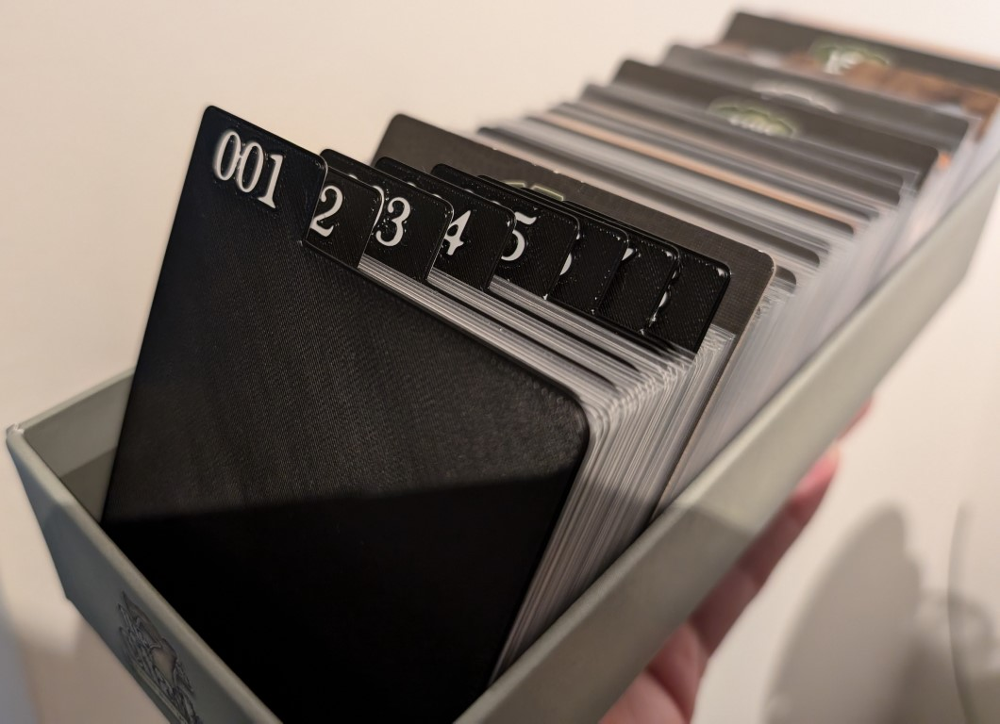
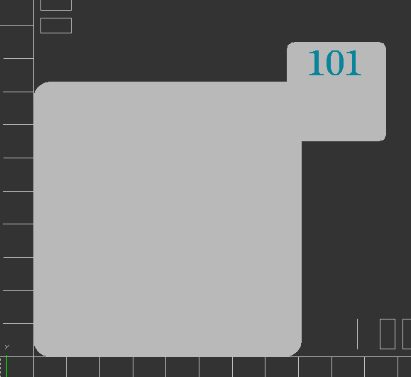

# 7th Citadel Dividers



OpenSCAD code for designing dividers for the boardgame 7th Citadel (can also be used for 7th Continent) by Serious Poulp. For personal use only.

The base game comes with dividers for every 50 cards, these dividers provide easy access to the more used cards.

# Acknowledgement
The code is based on the excellent parametric design of user `phrozen` on thingiverse. Check out the original code and stls on [https://www.thingiverse.com/thing:3714742](https://www.thingiverse.com/thing:3714742). 

I merely changed the code to support more 'divisions' for the tab location:


And a way to make solid tabs:


Furthermore I used the amazing divider template made by BoardGameGeek user `Nitrik` as a basis for generating the `.stl` files. See [https://boardgamegeek.com/filepage/274641/additional-dividers](https://boardgamegeek.com/filepage/274641/additional-dividers) for the original template. 
And also check out the post in the forums with additional information: [https://boardgamegeek.com/thread/3253085/addtional-custom-dividers](https://boardgamegeek.com/thread/3253085/addtional-custom-dividers).

Lastly you can also check out the page on Printables where I have hosted the `.stl` files and prepared `.gcode` as well [https://www.printables.com/model/946923-7th-citadel-dividers](https://www.printables.com/model/946923-7th-citadel-dividers).

# Printing the files
I used a Prusa MK3S and Prusa Slicer to slice and print the stl files. I sliced the file with a layer height of 0.30mm which will then produce `.gcode` with 2 layers. I recommend using a color swap after the first layer to print the first layer in white and the second layer in black. Happy printing!

# Included dividers
The dividers that are currently included have these numbers:
- 001
- 002
- 003
- 004
- 005
- 006
- 007
- 008
- 013
- 014
- 049
- 051
- 099
- 101
- 102
- 103
- 104
- 105
- 106
- 149
- 199
- 251
- 299
- 301
- 351
- 399
- 401
- 451

# Usage
If you want to make additional dividerse you can do the following:

Open the `.scad` file in OpenSCAD and use the parameters to change the number, division, size and aligment of the tab. You can also use the pre-generated `.stl` files in this repository or on [Printables](https://www.printables.com/model/946923-7th-citadel-dividers), on Printables you will also find the pre sliced `gcode` with color swap for the dividers.

Overview of parameters:

## divider_num
```
// The actual number to show on top.
divider_num = "101";
```
The number that shows on the tab itself.

## num_font
```
// Font for the text
// tested on Windows, may need changes for other systems
num_font = "Plantagenet Cherokee";
```
The font that is used to draw the number set by `divider_num`

##text_offset
```
// text offset
// may need adjustment in case you change the font
text_offset = 6;
```

## divide_by
```
// Divide by 1, halves, thirds, fourths etc
// 1 = no divide, 2 = halves, 3 = thirds, 4 = fourths, ...
divide_by = 3;
```
The number of divisions that should be made for tabs. Meaning the number of places a tab can be adjusted to by changing the `divider_align` value.

For example: When the `divide_by` is set to `5` there will be 5 places that the tab can be aligned to: _left, left_middle, middle, right_middle, right_.

## divider_align
```
// Alignment of the tab
// by 1         0 = left, 1 = right
// by halves    0 = left, 1 = right
// by thirds    0 = left, 1 = middle, 2 = right
// by fourths   0 = left, 1 = left_middle, 2 = right_middle, 3 = right
// etc
divider_align = 0;
```
Sets the alignment (or location) of the tab. Works in conjunction with `divide_by`. NOTE that this number is zero indexed.
For example: When the `divide_by` is set to `5` there will be 5 places that the tab can be aligned to: _left, left_middle, middle, right_middle, right_ with values _0, 1, 2, 3, 4_.

## solid_tab
```
// Make tab solid
// 0 == No, keep small tab, 1 == Yes, make solid tab stretching across divider
solid_tab = 0;
```
This value lets the user create a solid tab stretching the whole width of the divider. Can be used in conjunction with `divider_align` (and a corresponding `divide_by` value) to align the text to where the user prefers (for example the middle).

# Troubleshooting

##Font not working


If you notice that the font is not working (_see above image for how it should look_) try the following:
- Download the font for free for personal use on [Fonts Family](https://freefontsfamily.net/plantagenet-cherokee-font-free/)
- Install the `.tff` file **for all users** (**NOTE** this is the important bit!)

## Floating tab off to the side

Check the values of the `divide_by` and `divider_align`. The `divide_by` value is indexed at 1 and the `divider_align`is indexed at 0. So if the `divide_by` parameter is set to 4 the possible values of `divide_by` are _0, 1, 2, 3_. 
As you might have noticed there are no guardrails, so always check these values.
